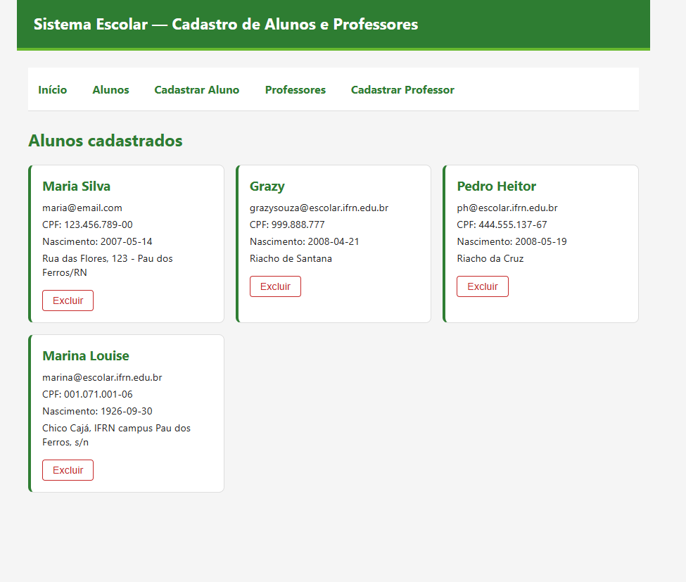

# 🏫 Sistema Escolar — CRUD de Professores

Atividade prática de React desenvolvida para a disciplina de **Programação para Internet** do **IFRN**. O projeto consiste no desenvolvimento do módulo completo (Listagem, Cadastro e Exclusão) para o gerenciamento de professores.

## 📸 Demonstração do Sistema

*(Substitua esta imagem pelo print da tela do seu sistema rodando)*

---

## 🛠️ Tecnologias Utilizadas

* **React** + **Vite**
* **React Router Dom** (Navegação)
* **Axios** (Requisições HTTP)
* **JSON Server** (Banco de dados simulado)
